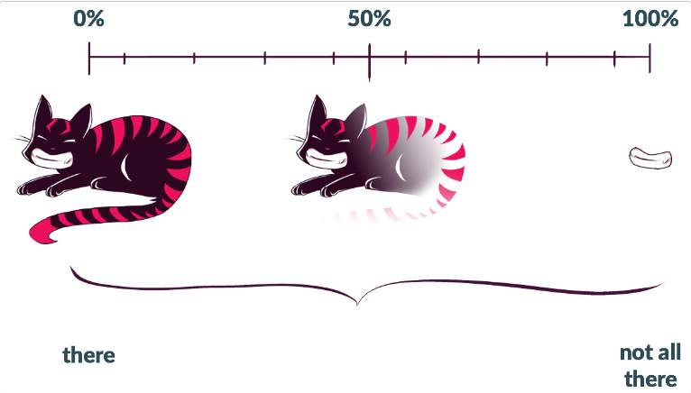
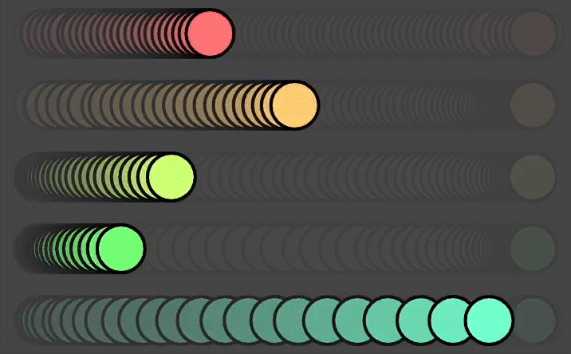
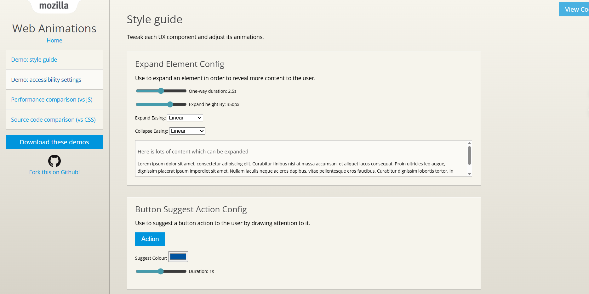

# Quiz 8 – Design Research

## Part 1: Imaging Technique Inspiration

I was inspired by the fluid animations on the Web Animations API demo site (mozdevs' animation examples). The transitions between UI elements, easing curves, and motion flows create a sense of spatial continuity and elegant dynamism. I aim to incorporate this “motion narrative” into my projects—making interactions or scene transitions feel like part of a story, rather than abrupt jumps.  

  
  

## Part 2: Coding Technique Exploration

To achieve this, I will utilize the Web Animations API in JavaScript, which enables keyframe-based animations, timing control, easing, and playback via scripting. This allows me to programmatically animate CSS properties, link transitions, and synchronize motion through logic. The Animation-examples repository provides numerous ready-to-use demonstrations.

  

!Example Code / Repo: [mozdevs/Animation-examples](https://github.com/mozdevs/Animation-examples)  
